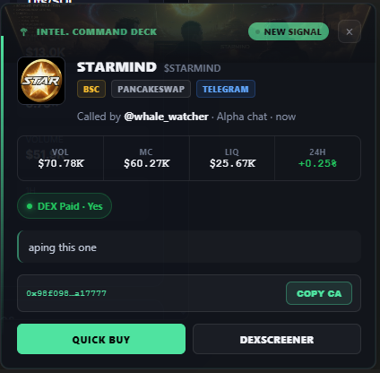

<div align="center">


# Stop watching the chats. The calls come to you.

**A trading desk that reads your Telegram and Discord for you — and interrupts
you only when something is worth it.**

[](../../releases)
[](#privacy)
[](#privacy)
[](LICENSE)

[**Download**](../../releases) · [Setup](docs/SETUP.md) ·
[How it works](docs/HOW-IT-WORKS.md) · [Architecture](docs/ARCHITECTURE.md)

</div>

---

## Twenty rooms. One set of eyes.

You are in twenty groups and you can read one. The call you missed was on
screen — in a window you weren't looking at. So you sit there watching chats,
which is the least valuable thing you do all day.

**intel. does the reading.** It signs into those rooms as you, drops the scanner
bots, counts the same person posting five times as one call, enriches whatever
survives, and puts it on your desktop.

Then you close the chat windows and go do something else — scan the trenches
yourself, work a chart, sleep, do your job. **The calls still arrive.**

> The promise isn't more signal. It's your attention back, without missing the call.

---

## What it actually does

| | |
| --- | --- |
| 🛰️ **Reads every room** | Telegram groups + Discord servers — whole servers or single channels, with per-source member allow/block lists. One account here reached **18 servers / 1,295 channels**. |
| 🧹 **Kills the noise** | Echo bots dropped outright. One human = one call — so *"called 3×"* means three different people, and the card names them. **205 of 500** tracked tokens were genuinely called by more than one person. |
| 🔔 **Interrupts you properly** | A desktop notification that fills in *live*: market data instantly, then DEX-paid, artwork, holders and KOL handles — measured **50–460 ms** behind the alert. |
| 🗺️ **Tracks the spread** | The same CA turning up in a second group — then in a Discord server you also watch — is the signal. Every room it has been called in, who called it there, and when. |
| 🐋 **Shows who's in it** | KOL and smart-money wallets **currently holding**, not everyone who ever touched it. |
| 🧊 **Freezes the entry** | Market cap captured at the moment of the call, so the multiplier measures *the call* rather than drifting with the chart. |
| ⭐ **Watches your picks** | Star a token: get told when it's called again, re-scanned, or when smart money buys it. |
| 📊 **Scores the callers** | Median multiple and win rate per caller — computed **only** over calls with a real measured outcome, and it says so. |
| 🔒 **Stays on your machine** | No account, no server, no telemetry, no auto-update. |

**Unknown values say `unknown`.** A missing safety score never renders as a
passing one, and a chain with no provider says so instead of showing a
confident blank. That honesty is the point — you can act on this.

---

## The notification is the product

Everything else is plumbing. The toast is what you actually live with:

```
┌──────────────────────────────────────────────────────┐
│ ⌁ INTEL. COMMAND DECK                 ● NEW SIGNAL  ×│
│                                                      │
│  ▣  Max Sister  $LILY                                │
│     [BSC] [PANCAKESWAP] [TELEGRAM]                   │
│     Called by @whale_watcher · Alpha chat · now       │
│     2.40x median · 61% win · 18 scored                │
│                                                      │
│   VOL        MC          LIQ         24H             │
│   $2.1M      $1.8M       $312K       +420%           │
│                                                      │
│   HOLDERS    TOP 10      RISK                        │
│   394        18%         12%                         │
│                                                      │
│  ● DEX Paid · Yes          KOLs 14   Smart Wallets 31│
│  @alkuap  @CL_CLACL  @0xFelix                        │
│                                                      │
│  aping this one                                      │
│  0x7dbc…7777                             [COPY CA]   │
│  [    QUICK BUY    ]  [    DEXSCREENER    ]          │
└──────────────────────────────────────────────────────┘
```

It opens the instant a call is detected, then **fills itself in** as providers
answer — you see the market data immediately and the safety, holder and wallet
data a heartbeat later. Buttons work: Copy CA, the chart, and a chain-correct
quick-buy link.

Star a token and it re-alerts you when that token is **called again**,
**re-scanned**, or when **smart money buys it** — labelled so a re-alert is
never mistaken for a fresh call.

A "called again" alert shows **the mention that triggered it**: who just called
it, in which room, on which platform, what they said, and how many rooms it has
now spread to. Not the original call from three days ago.

---

## Install

### Option A — installer (recommended)

Download **`intel-Command-Deck-Setup-x.y.z.exe`** from
[Releases](../../releases) and run it. Standard wizard: pick a folder, get a
desktop and Start-menu shortcut.

It installs per-user, so **no admin rights and no UAC prompt**. Uninstalling
leaves your credentials and signal history alone.

### Option B — portable

Download **`intel-Command-Deck-Portable-x.y.z.exe`** and run it. No install, no
shortcuts — it unpacks to a temp folder on each launch. Good for a USB stick.

> **SmartScreen** will warn on first run, because the binary isn't code-signed
> (a certificate costs a few hundred dollars a year). Click **More info → Run
> anyway**. If you'd rather not trust a binary, build it yourself — see below.

**First launch takes about 15 seconds** while the backend starts and connects.

### Option C — build from source

Requires **Node.js 20+**.

```bash
git clone https://github.com/dwdo1337/intel.git
cd intel
npm install
cd client && npm install && cd ..
npm run electron:pack
```

Both installers land in `dist-electron/`. To run in development instead:

```bash
npm run build          # build the UI
node server/index.js   # backend + UI on http://127.0.0.1:5050
```

---

## Setup

Full walkthrough in **[docs/SETUP.md](docs/SETUP.md)**. In short, open Settings
in the app and connect:

| Source | What you need | Required? |
| --- | --- | --- |
| **Telegram** | `api_id` + `api_hash` from [my.telegram.org](https://my.telegram.org), then phone login | For Telegram rooms |
| **Discord** | your user token (there's a **Tutorial** button next to the field) | For Discord rooms |
| **GMGN** | an API key from gmgn.ai → Settings → API | Optional |

Without a GMGN key the app still runs: DexScreener market data on every chain
and RugCheck safety on Solana. You lose EVM safety checks, EVM holder counts,
some artwork, and KOL / smart-money data.

Credentials are written to `%APPDATA%\intel-command-deck\config.json` on your
machine and are never transmitted anywhere.

> ⚠️ **Discord user tokens are against Discord's Terms of Service.** A user
> token logs in as your account. This is your call to make; the app stores it
> locally and nowhere else.

---

## How it works

```
Telegram (GramJS user session) ─┐
                                ├─→ filter ─→ enrich ─→ store ─→ UI + desktop toast
Discord (gateway WebSocket) ────┘
```

Three processes: an Electron main process that draws the notification windows, a
Node backend (Express + Socket.IO) that ingests and enriches, and a React UI
served locally at `127.0.0.1:5050`.

More detail in [docs/HOW-IT-WORKS.md](docs/HOW-IT-WORKS.md) and
[docs/ARCHITECTURE.md](docs/ARCHITECTURE.md).

---

## Data providers

| Provider | Used for | Key needed | Coverage |
| --- | --- | --- | --- |
| DexScreener | price, liquidity, volume, artwork, DEX-paid | no | all chains |
| RugCheck | rug score, mint/freeze authority, holders | no | Solana only |
| GMGN | security, holder counts, KOL & smart money | **yes** | sol / bsc / base |
| Binance Web3 | aggregate smart-money flow | no | major chains |

Provider coverage differs by chain and the UI says so rather than showing a
confident blank.

---

## Privacy

- No account, no server, no analytics, no telemetry, no auto-update.
- Sessions, tokens and signal history live in `%APPDATA%\intel-command-deck\`.
- Outbound traffic goes only to the data providers above and to Telegram/Discord.
- `config.json` is git-ignored and excluded from the packaged binary; every
  release is byte-scanned for credentials before publishing.

---

## Screenshots

The notification, captured from the running build:



`TOP 10` and `RISK` render as `—` on chains with no safety provider rather than
showing a confident zero.

Full-deck screenshots are pending: the ones taken so far contained real chat
names and handles from a live account, so they were removed rather than
published. They will be re-captured against seeded demo data.

---

## Contributing

Setting up an agent or a new contributor? Hand them
**[AGENT-SETUP-PROMPT.md](AGENT-SETUP-PROMPT.md)** — a complete, self-contained
brief for getting the app installed, running and verified.

---

## Licence

[MIT](LICENSE). No warranty. This is a research and information tool: it does
not give financial advice, and it does not tell you a call is good.
