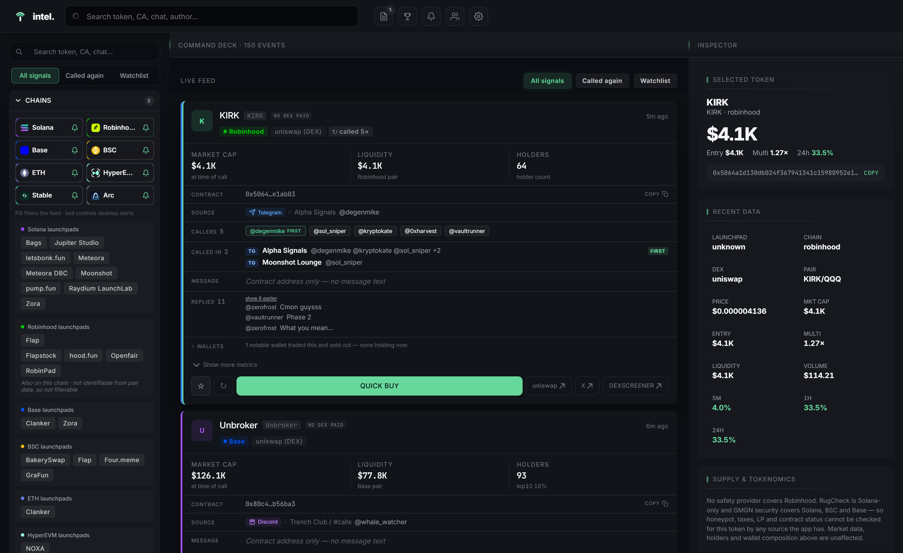
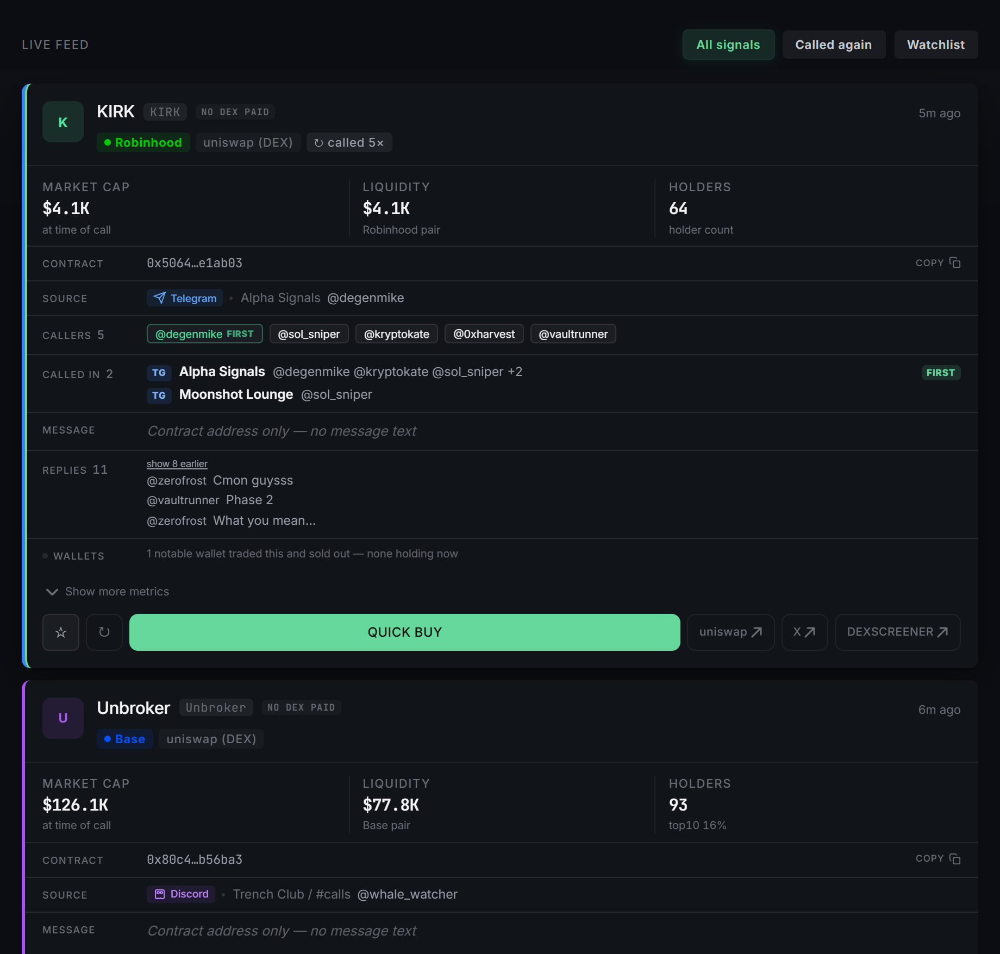
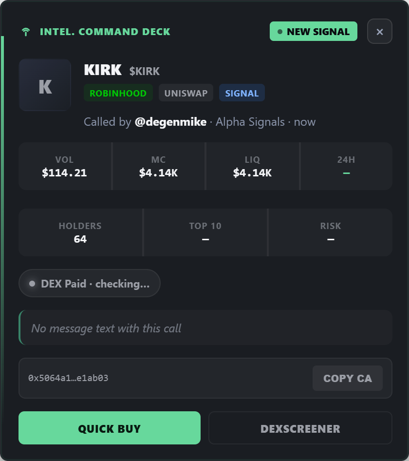
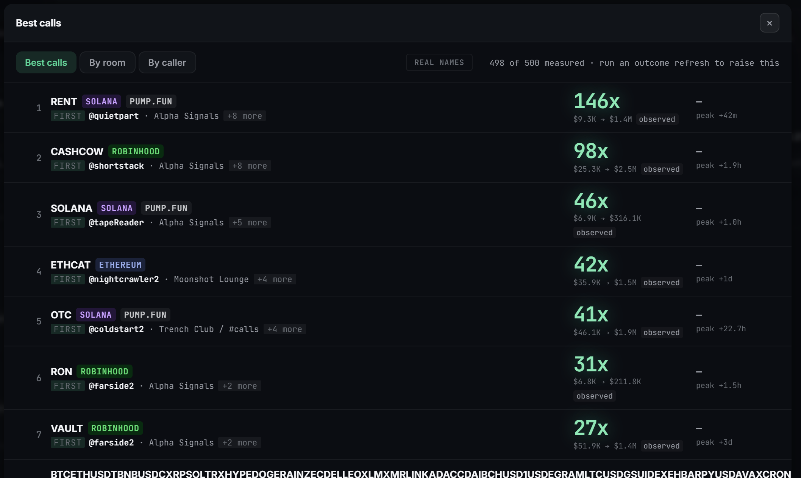
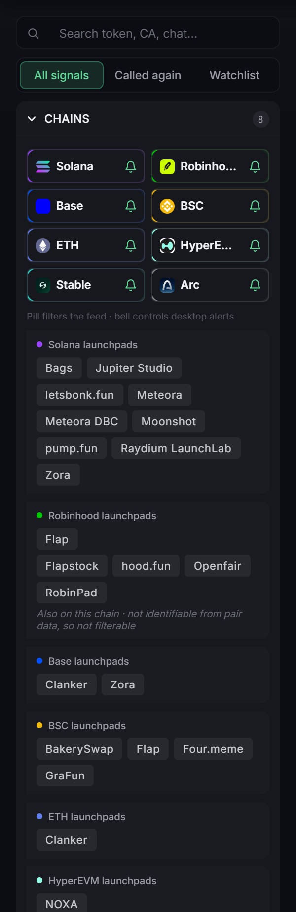
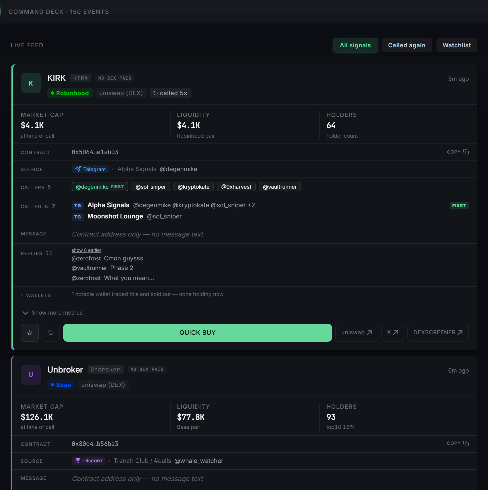

<div align="center">


# Stop watching the chats. The calls come to you.

**A trading desk that reads your Telegram and Discord for you — and interrupts
you only when something is worth it.**

[](../../releases)
[](#privacy)
[](#privacy)
[](LICENSE)

[**Download**](../../releases) · [Setup](docs/SETUP.md) ·
[How it works](docs/HOW-IT-WORKS.md) · [Architecture](docs/ARCHITECTURE.md) ·
[Changelog](CHANGELOG.md)

[](https://x.com/intelcmddesk)
[](https://t.me/intelcommand)

</div>



---

## Twenty rooms. One set of eyes.

You are in twenty groups and you can read one. The call you missed was on
screen — in a window you weren't looking at. So you sit there watching chats,
which is the least valuable thing you do all day.

**intel. does the reading.** It signs into those rooms as you, drops the scanner
bots, counts the same person posting five times as one call, enriches whatever
survives, and puts it on your desktop.

Then you close the chat windows and go do something else — scan the trenches
yourself, work a chart, do your job. **The calls still arrive.**

> The promise isn't more signal. It's your attention back, without missing the call.

### One thing to be clear about

**It does not find alpha. It catches it.** The alpha is the rooms you are
already in; the problem is reading all of them at once. If your rooms are quiet,
this will not conjure anything — it will faithfully report the quiet.

---

## What it actually does

| | |
| --- | --- |
| 🛰️ **Reads every room** | Telegram groups + Discord servers — whole servers or single channels, with per-source member allow/block lists. Servers collapse into a searchable list with per-server counts, because a flat wall of a thousand channels is not a chooser. |
| 🧹 **Kills the noise** | Echo bots dropped outright. One human = one call — so *"called 3×"* means three different people, and the card names them. **175 of 500** tracked tokens were genuinely called by more than one person. |
| 🔔 **Interrupts you properly** | A desktop notification that fills in *live*: market data instantly, then DEX-paid, artwork, holders and KOL handles — measured **50–460 ms** behind the alert. |
| 🗺️ **Tracks the spread** | The same CA turning up in a second group — then in a Discord server you also watch — is the signal. Every room it has been called in, who called it there, and when. |
| 📈 **Records the peak** | How far a call actually ran, not just what it is worth now. |
| 🐋 **Shows who's in it** | KOL and smart-money wallets **currently holding**, not everyone who ever touched it. |
| 🧊 **Freezes the entry** | Market cap captured at the moment of the call, so the multiplier measures *the call* rather than drifting with the chart. |
| ⭐ **Watches your picks** | Star a token: get told when it's called again, re-scanned, or when smart money buys it. |
| 📊 **Scores the callers** | Median multiple and win rate per caller — computed **only** over calls with a real measured outcome, and it says so. |
| 🔒 **Stays on your machine** | No account, no server, no telemetry, no auto-update. |

**Unknown values say `unknown`.** A missing safety score never renders as a
passing one, and a chain with no provider says so instead of showing a
confident blank. That honesty is the point — you can act on this.

---

## The card



Everything on one card, in the order you actually ask the questions.

- **`called 5×` and five named callers** — five *different* people, with the
  first one badged. The same person posting five times is one call, because the
  second post is not new information.
- **`CALLED IN 2`** — which rooms, who called it in each, on which platform.
  A call that crosses from one group into another is the thing worth knowing.
- **The caller's own message**, with the contract address highlighted in place.
  Not a summary — what they actually wrote.
- **Replies** from both platforms, including reply-to-reply chains and Discord
  threads, so you can see the room's reaction rather than guess it.
- **`at time of call`** under the market cap. That number is frozen at the
  moment the call landed and does not drift with the chart.
- **The wallet line** counts only wallets holding a live position. *"1 notable
  wallet traded this and sold out — none holding now"* is a very different
  sentence from *"1 KOL"*, and the second one is the lie.

---

## The alert



Everything else is plumbing. The notification is what you live with.

It opens the instant a call is detected and **fills itself in** as providers
answer — market data immediately, then DEX-paid, artwork, holder counts and KOL
handles a heartbeat later.

The buttons work: **Copy CA**, the chart, and a **chain-correct** quick-buy link
(the wrong chain sends you to a blank page, so the link is built per chain and
falls back to the pair when no venue covers it).

`TOP 10` and `RISK` show `—` here because **no safety provider covers the
Robinhood chain**. They are not zeroes, and they are not hidden — the app says
what it does not know.

Star a token and it re-alerts when that token is **called again**,
**re-scanned**, or when **smart money buys it** — each labelled, so a re-alert
is never mistaken for a fresh call. Those arrive as a shorter note, about 60% of
the height: you already know the token, that is why it is starred.

A "called again" alert carries **the mention that triggered it** — who just
called it, where, and what they said. Not the original call from three days ago.

<br clear="right">

---

## The board — how far calls actually ran



Most boards score a call by what the token is worth **today**, which for a
memecoin is almost never the interesting number. One call here went from
**$8,062 to $64,616 and died** — recorded as a total loss, despite being an 8×.

So the peak is stored: a free high-water mark plus a candle backfill. One row
per token, credited to whoever called it **first**, with the current value
always beside it, because a board that only shows how far a call ran flatters
every rug.

- **Sort by room or by caller** — which of your groups actually produces runners.
- **`498 of 500 measured`** is stated on the board. A call with no measured
  outcome is **excluded**, not scored `1.00×`.
- **`observed`** marks a peak this app watched happen, as opposed to one
  reconstructed from candles.
- A **redaction toggle** on this board masks every handle and room to a stable
  label (`caller 1`, `room 2`), so the board can be shared without sharing who
  is in your groups.

---

## Filters that tell the truth



**Two controls per chain, on purpose.** The pill filters the *feed*; the bell
decides whether that chain may raise a *desktop alert*. They used to be one
control, which meant turning a chain on to look at it silently re-armed its
notifications.

**Launchpad chips come from the server's own detection map**, so a filterable
chip exists exactly when detection exists.

Launchpads that are real on a chain but **cannot be identified from pair data**
are listed too — dimmed, unclickable, under *"not identifiable from pair data,
so not filterable"*. They deploy onto a shared AMM, so nothing distinguishes
their tokens from any other token on that AMM. Showing them as working filters
would be a lie; hiding them would throw away true information about the chain.

Below the chains: min/max ranges for market cap, liquidity, volume, age,
holders, top-10 concentration, dev holdings and rug risk — plus one switch that
decides whether those thresholds gate **alerts** as well as the feed. It is off
by default: narrowing a view is looking, silencing an alert is a decision.

<br clear="left">

---

## The inspector



The right-hand column follows whatever is selected: price, entry, multiple,
supply, tokenomics, holder distribution and wallet exposure.

When a chain has no provider for a field, the inspector **says which provider
is missing and why**, rather than printing five `unknown` rows that read like
five failed lookups.

It also follows the filter. It used to be possible for the inspector to display
one token while the feed beside it listed another — which reads as *"the data is
wrong"* rather than *"these are two different tokens"*.

<br clear="right">

---

## Install

### Option A — installer (recommended)

Download **`intel-Command-Deck-Setup-x.y.z.exe`** from
[Releases](../../releases) and run it. Standard wizard: pick a folder, get a
desktop and Start-menu shortcut.

It installs per-user, so **no admin rights and no UAC prompt**. Uninstalling
leaves your credentials and signal history alone.

### Option B — portable

Download **`intel-Command-Deck-Portable-x.y.z.exe`** and run it. No install, no
shortcuts — it unpacks to a temp folder on each launch. Good for a USB stick.

> Prefer the installer if you can. The portable build re-extracts to `%TEMP%` on
> every launch, and on a machine that cleans that folder aggressively the
> extraction can be removed **while the app is running**.

> **SmartScreen** will warn on first run, because the binary isn't code-signed
> (a certificate costs a few hundred dollars a year). Click **More info → Run
> anyway**. If you'd rather not trust a binary, build it yourself — see below.

**First launch takes about 15 seconds** while the backend starts and connects.

### Option C — build from source

Requires **Node.js 20+**.

```bash
git clone https://github.com/dwdo1337/intel.git
cd intel
npm install
cd client && npm install && cd ..
npm run electron:pack
```

Both installers land in `dist-electron/`. To run in development instead:

```bash
npm run build          # build the UI
node server/index.js   # backend + UI on http://127.0.0.1:5050
```

---

## Setup

Full walkthrough in **[docs/SETUP.md](docs/SETUP.md)**. In short, open Settings
in the app and connect:

| Source | What you need | Required? |
| --- | --- | --- |
| **Telegram** | `api_id` + `api_hash` from [my.telegram.org](https://my.telegram.org), then phone login | For Telegram rooms |
| **Discord** | your user token (there's a **Tutorial** button next to the field) | For Discord rooms |
| **GMGN** | an API key from gmgn.ai → Settings → API | Optional |

Without a GMGN key the app still runs: DexScreener market data on every chain
and RugCheck safety on Solana. You lose EVM safety checks, EVM holder counts,
some artwork, and KOL / smart-money data.

> **Pick your rooms after connecting.** With chats selected the list acts as a
> **whitelist** — anything unticked is invisible. Watching two rooms out of
> eighty is the single biggest thing that limits what this can catch.

Credentials are written to `%APPDATA%\intel-command-deck\config.json` on your
machine and are never transmitted anywhere.

> ⚠️ **Discord user tokens are against Discord's Terms of Service.** A user
> token logs in as your account. This is your call to make; the app stores it
> locally and nowhere else.

---

## How it works

```
Telegram (GramJS user session) ─┐
                                ├─→ filter ─→ enrich ─→ store ─→ UI + desktop toast
Discord (gateway WebSocket) ────┘
```

Three processes: an Electron main process that draws the notification windows, a
Node backend (Express + Socket.IO) that ingests and enriches, and a React UI
served locally at `127.0.0.1:5050`.

More detail in [docs/HOW-IT-WORKS.md](docs/HOW-IT-WORKS.md) and
[docs/ARCHITECTURE.md](docs/ARCHITECTURE.md).

---

## Data providers

| Provider | Used for | Key needed | Coverage |
| --- | --- | --- | --- |
| DexScreener | price, liquidity, volume, artwork, DEX-paid | no | all chains |
| RugCheck | rug score, mint/freeze authority, holders | no | Solana only |
| GMGN — security | honeypot, taxes, contract risk | **yes** | sol / bsc / base |
| GMGN — holders | holder counts, KOL & smart money | **yes** | sol / bsc / robinhood |
| GMGN — market | pool liquidity, candles for peak backfill | **yes** | sol / bsc / base / eth / robinhood / arc / stable |
| Binance Web3 | aggregate smart-money flow | no | major chains |

Provider coverage differs by chain and the UI says so rather than showing a
confident blank. Chains with no safety provider at all — Robinhood and HyperEVM
among them — still get full market data, and the safety fields say why they are
empty.

---

## Privacy

- No account, no server, no analytics, no telemetry, no auto-update.
- Sessions, tokens and signal history live in `%APPDATA%\intel-command-deck\`.
- Outbound traffic goes only to the data providers above and to Telegram/Discord.
- `config.json` is git-ignored and excluded from the packaged binary; every
  release is byte-scanned for credentials before publishing.

---

## About the screenshots

Every image above is an **unretouched capture of the running build** — no
mockups, no redrawn UI, no numbers edited in.

The market data is real: real tokens, real entry market caps, real peaks
measured by this app. **The identities are not.** Every handle and room name was
replaced with a fictional one before the captures were taken, because the rooms
this was tested against belong to real people. Nothing in these images points at
anybody.

Settings and Sources are deliberately absent — those screens read a live account
and are never captured.

---

## Contributing

Setting up an agent or a new contributor? Hand them
**[AGENT-SETUP-PROMPT.md](AGENT-SETUP-PROMPT.md)** — a complete, self-contained
brief for getting the app installed, running and verified.

---

## Licence

[MIT](LICENSE). No warranty. This is a research and information tool: it does
not give financial advice, and it does not tell you a call is good.

<div align="center">
<br>

**[x.com/intelcmddesk](https://x.com/intelcmddesk)** · **[t.me/intelcommand](https://t.me/intelcommand)**

</div>
